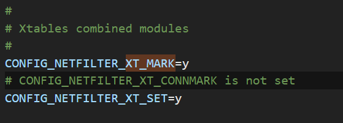

# Environments

- WSL version: 2.0.15.0
- Kernel version: 5.15.133.1-1
- WSLg version: 1.0.59
- MSRDC version: 1.2.4677
- nDirect3D version: 1.611.1-81528511
- DXCore version: 10.0.25131.1002-220531-1700.rs-onecore-base2-hyp
- Windows version: 10.0.22621.2861

# Building from source
Followed instructions here:

http://mahimahi.mit.edu/#getting

Installed deps:

```
sudo apt install apache2-dev apache2-bin dnsmasq-base protobuf-compiler libssl-dev ssl-cert libxcb-present-dev 
```
Note that pkg-config had been installed when compiling webrtc.

# WSL2 kernel issues

Tested ```mm-delay 50``` failed because iptables -j CONNMARK failed. It's from xt_mart module in linux kernel.

However, WSL2 is a modified version of Linux, loading modules is not supported.(All loaded staticaly). We need to set xt_mark on and recompile the kernel.

# Kernel compiling

Followed instruction:

https://unix.stackexchange.com/questions/594470/wsl-2-does-not-have-lib-modules

## .config 

When compiling, set .config file with CONNMARK on. Default is off:




CMDS：
```
# deps
sudo apt install build-essential flex bison libssl-dev libelf-dev git dwarves

# kernel source
git clone https://github.com/microsoft/WSL2-Linux-Kernel.git

cd WSL2-Linux-Kernel
cp Microsoft/config-wsl .config

# make kernel
make -j $(expr $(nproc) - 1)

# make modules
make modules 

# make modules install
make modules_install
```

Replace the kernel with .wslconfig and restart, it ran successfully.
