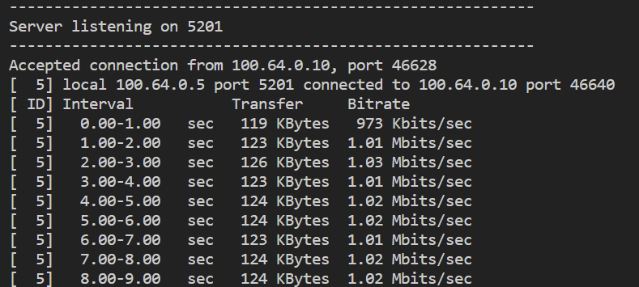
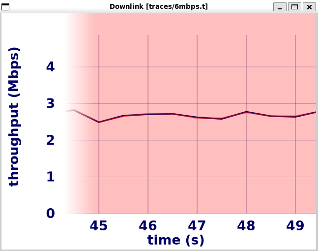

# Mahimahi

- Emulate network conditions

Mahimahi supports emulating fixed propagation delays (DelayShell), fixed and variable link rates (LinkShell), stochastic packet loss (LossShell).

http://mahimahi.mit.edu/

# Test mm-link with iperf
 
```
# bandwidth up down
mm-link --meter-all traces/1mbps.t traces/1mbps.t

# set as a client 
iperf3 -c 100.64.0.5
```



# WebRTC Test

Metered by mm-link, the actual throughput of webRTC has stabilized at around 3Mbps, despite bandwidth is 6Mbps. Need to 



